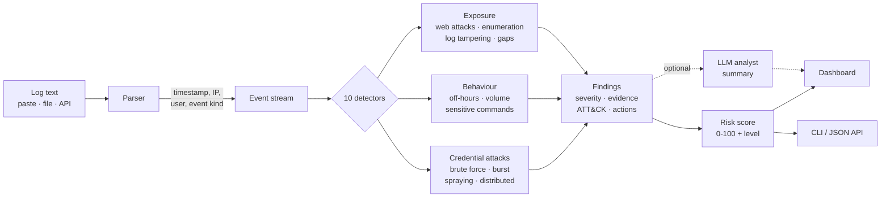

# LogMind — AI Security Log Anomaly Explainer

[](https://github.com/Muhammadwaseem5131/logmind/actions/workflows/test.yml)
[](https://muhammadwaseem5131.github.io/logmind/)
[](https://python.org)
[](LICENSE)

Detects unusual patterns in security logs and explains them in plain language,
with a risk level, MITRE ATT&CK mapping, and recommended actions.

No installs, no dependencies, no internet required — Python standard library only.

## Install

There is nothing to install. Python 3.8 or newer is the only requirement, and
every import is from the standard library.

```bash
git clone https://github.com/Muhammadwaseem5131/logmind.git
cd logmind
python logmind.py --test     # proves the build is good
python logmind.py            # opens the dashboard
```

On Windows you can double-click **`start.bat`** instead; on macOS or Linux run
**`./start.sh`**. Both run the self-check first and refuse to start if it fails.

If `python` is not recognised, install it from
[python.org/downloads](https://python.org/downloads) and tick *"Add python.exe
to PATH"* during setup. No `pip install` step exists, because there is nothing
to install.

The dashboard opens in your browser. Press **Load demo log** to see it work.

**[Open the live demo →](https://muhammadwaseem5131.github.io/logmind/)** —
three real attack logs, already analysed, no install needed. Rebuilt from the
samples on every push by the `demo page` workflow.

Every push also runs the full test suite on **Linux, macOS, and Windows**
across Python 3.8 and 3.12 — the badge above is that result, not a claim.

## How it works



The parser and the ten detectors are pure functions over an event list, which
is why the same engine serves the dashboard, the CLI, the JSON API, and the
accuracy benchmark without a second code path.

## Accuracy

Measured on a 105-log labelled benchmark (55 attack, 50 benign) — full method
and the false positives it does **not** hide in [EVALUATION.md](EVALUATION.md):

| Metric | Result |
|---|---|
| Attack logs detected | 55 / 55 (recall 1.00) |
| Per-detector macro F1 | 0.89 |
| False alarms on hard benign logs | 15 / 50 |
| False alarms on realistic benign logs | 0 / 35 |

The 15 false alarms are three known-ambiguous cases — an office NAT gateway, a
password-rotation day, and a scheduled load test — each documented with why the
log alone cannot separate them from the real thing.

```bash
python evaluate.py
```

## Live mode

One machine watches the logs it can reach and reports continuously. It never
blocks, never modifies a firewall, and never touches the system it watches —
it reads, analyses, and tells you.

```bash
python watch.py /var/log/auth.log --port 8000
```

```
LogMind watching 1 source(s): /var/log/auth.log
window 15m | detectors every 10s | alert cooldown 10m | notify only, nothing is ever blocked
live dashboard -> http://localhost:8000

[10:18:46] HIGH   Successful login after repeated failures (203.0.113.45)
  203.0.113.45 failed 12 times, then logged in successfully as 'carol'...
  ATT&CK: T1110 Brute Force
  -> Force a password reset and end active sessions for the account
[10:33:00] normal: 1.5 events/min, 4 failed (7%), 6 source IPs, 3 accounts | nothing abnormal for 14m
```

Two kinds of line: **alerts** when something is abnormal, and a periodic
**normal** line so you can see the baseline it is judging against.

| | |
|---|---|
| Many logs at once | `python watch.py "/var/log/*.log" /var/log/nginx/access.log` |
| Anything on a pipe | `journalctl -f \| python watch.py -` |
| Windows events | `Get-WinEvent -LogName Security ... \| python watch.py -` |
| Live dashboard | `--port 8000` — the normal UI, refreshing itself |
| Chat alerts | `--webhook https://hooks.slack.com/...` |
| Tuning | `--window 15 --interval 10 --cooldown 10 --status 15` (minutes / seconds) |

It handles the things that break naive tailers: log rotation, truncation,
a writer caught mid-line, and repeat alerts — one alert per distinct finding
per cooldown, not one per scan. `python watch.py --test` proves each of those.

**It does not block, by design.** Log lines are attacker-controllable, and the
benchmark shows an office NAT gateway looks exactly like one IP probing many
accounts — auto-blocking that logs out a building. LogMind reports; a human
decides.

**What it can and cannot see:** it reads logs, not packets. Point it at
firewall, proxy, VPN, and web-server logs and it sees the network behaviour
those record. It cannot see traffic nothing logged.

## Run modes

| Command | What it does |
|---|---|
| `python logmind.py` | Dashboard on http://localhost:8000 (`python logmind.py 8137` for another port) |
| `python logmind.py samples/insider.log` | Plain-text report to the terminal |
| `python logmind.py --json samples/insider.log` | Machine-readable JSON report |
| `python logmind.py --test` | Self-check across all sample logs |
| `POST /api/analyze` with raw log text | JSON report over HTTP |

## What it detects

| # | Detector | Fires when | MITRE |
|---|---|---|---|
| 1 | Successful brute force | ≥5 failures from an IP, then a success from the same IP | T1110 |
| 2 | Failed login burst | ≥5 failures from one IP inside 60s | T1110.001 |
| 3 | Account probing | One IP tries ≥3 usernames | T1110.003 |
| 4 | Distributed attack | One account attacked from ≥3 IPs | T1110.003 |
| 5 | Volume spike | A minute with ≥10 events and >3× the median | T1499 |
| 6 | Off-hours access | Successful logins 22:00–05:00 on a host with a daytime baseline | T1078 |
| 7 | Sensitive commands | shadow/id_rsa reads, useradd, chmod 777, curl‑pipe‑bash, `history -c`, auditd stopped, reverse shells | T1003 / T1136 / T1222 / T1059 / T1070 / T1562 |
| 8 | Web attack patterns | Traversal, SQLi, XSS, JNDI, sensitive-path scanning — flagged **High** if any returned 2xx | T1190 / T1595 |
| 9 | Username enumeration | ≥8 invalid usernames from ≥2 sources | T1087 |
| 10 | Log tampering / gaps | Log-clearing lines, or a ≥30 min gap 20× the normal interval | T1070.002 |

Each finding carries: severity, a plain-English explanation, the log lines that
triggered it, and 2–4 concrete next actions.

## Log formats

Syslog (`Aug 10 14:31:02 …`), ISO (`2026-08-10 14:31:02`), and web access logs
(`10/Aug/2026:14:31:02`). Lines without a parseable timestamp still get analysed
— they get a synthetic 1s ordering, and wall-clock checks skip them.

## Optional AI summary

Detection is rule-based and runs fully offline. With an Anthropic API key,
LogMind adds one analyst-voice paragraph tying the findings together.

Open **"Optional — add an AI key for an analyst summary"** under the log box
and paste your key. No editing files, no environment variables — each user
brings their own key. `ANTHROPIC_API_KEY` still works as a fallback for
scripted use, and `POST /api/analyze` accepts an `X-Api-Key` header.

How the key is handled:

- only the **findings** are sent to the API, never your raw log
- used for that one request, then dropped — never written to disk or logged
- never echoed back into the page or included in an exported report
- stored in your browser **only** if you tick *Remember in this browser*
- the call has a hard deadline; a wrong key or dead network shows a message
  and the report renders regardless

## Interface

Dark-first data-dense dashboard, light theme remembered per browser.

- **First run** — hero, three-step explainer, and one-click demo attack cards
  instead of an empty box.
- **Results** — sticky status bar, stacked event timeline (with a "show the
  numbers" data table for screen readers), findings column plus a sticky
  sidebar holding the risk gauge, severity breakdown, top sources, and exports.
- **Evidence** — the IPs, usernames, and keywords that triggered each finding
  are highlighted inside the log lines, so you can see *why* it fired.
- **ATT&CK** — every technique badge links to attack.mitre.org.
- **Filters** — severity chips deep-link via the URL hash (`#sev=High`).
- **Export** — Markdown to clipboard, JSON download, or print/PDF.

Accessibility: keyboard operable with a skip link and visible focus rings,
44px touch targets, no horizontal scroll at 375px, `prefers-reduced-motion`
honoured, and every text pair measured at ≥4.5:1 in **both** themes.

Design tokens generated with `ui-ux-pro-max` — see
[design-system/logmind/MASTER.md](design-system/logmind/MASTER.md).

## Files

```
logmind.py                 engine, detectors, HTTP server, CLI, self-check
ui.html                    dashboard template (design system lives here)
watch.py                   live mode: tail, analyse, alert (never blocks)
evaluate.py                labelled benchmark -> EVALUATION.md
build_demo.py              renders demo.html, the static shareable snapshot
samples/brute_force.log    SSH brute force + spraying + botnet spread
samples/web_attack.log     scanner, SQLi, traversal that returned 200
samples/insider.log        off-hours access, privilege abuse, log clearing
design-system/             generated design tokens and rules
```

## Limits

Batch or live tail on one machine — no database, no multi-user, no agents on
other hosts, and no per-account baseline yet (it judges patterns, not "carol
never logs in from Brazil"). Uploads are capped at 5 MB and 50,000 lines. Detection is
heuristic: it finds these ten patterns, and finding nothing is not proof that
nothing happened.
