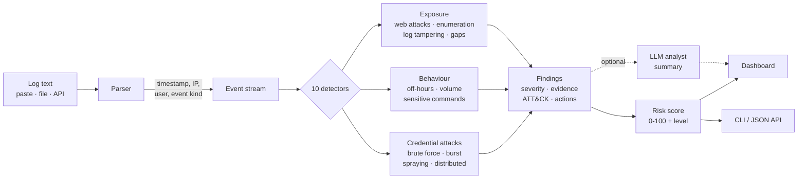

# LogMind — AI Security Log Anomaly Explainer

Detects unusual patterns in security logs and explains them in plain language,
with a risk level, MITRE ATT&CK mapping, and recommended actions.

No installs, no dependencies, no internet required — Python standard library only.

```bash
python logmind.py
```

The dashboard opens in your browser. Press **Load demo log** to see it work.

**[See a live snapshot of three analysed attack logs →](demo.html)**
(no install needed; rebuild it with `python build_demo.py`)

## How it works



The parser and the ten detectors are pure functions over an event list, which
is why the same engine serves the dashboard, the CLI, the JSON API, and the
accuracy benchmark without a second code path.

## Accuracy

Measured on a 105-log labelled benchmark (55 attack, 50 benign) — full method
and the false positives it does **not** hide in [EVALUATION.md](EVALUATION.md):

| Metric | Result |
|---|---|
| Attack logs detected | 55 / 55 (recall 1.00) |
| Per-detector macro F1 | 0.89 |
| False alarms on hard benign logs | 15 / 50 |
| False alarms on realistic benign logs | 0 / 35 |

The 15 false alarms are three known-ambiguous cases — an office NAT gateway, a
password-rotation day, and a scheduled load test — each documented with why the
log alone cannot separate them from the real thing.

```bash
python evaluate.py
```

## Run modes

| Command | What it does |
|---|---|
| `python logmind.py` | Dashboard on http://localhost:8000 (`python logmind.py 8137` for another port) |
| `python logmind.py samples/insider.log` | Plain-text report to the terminal |
| `python logmind.py --json samples/insider.log` | Machine-readable JSON report |
| `python logmind.py --test` | Self-check across all sample logs |
| `POST /api/analyze` with raw log text | JSON report over HTTP |

## What it detects

| # | Detector | Fires when | MITRE |
|---|---|---|---|
| 1 | Successful brute force | ≥5 failures from an IP, then a success from the same IP | T1110 |
| 2 | Failed login burst | ≥5 failures from one IP inside 60s | T1110.001 |
| 3 | Account probing | One IP tries ≥3 usernames | T1110.003 |
| 4 | Distributed attack | One account attacked from ≥3 IPs | T1110.003 |
| 5 | Volume spike | A minute with ≥10 events and >3× the median | T1499 |
| 6 | Off-hours access | Successful logins 22:00–05:00 on a host with a daytime baseline | T1078 |
| 7 | Sensitive commands | shadow/id_rsa reads, useradd, chmod 777, curl‑pipe‑bash, `history -c`, auditd stopped, reverse shells | T1003 / T1136 / T1222 / T1059 / T1070 / T1562 |
| 8 | Web attack patterns | Traversal, SQLi, XSS, JNDI, sensitive-path scanning — flagged **High** if any returned 2xx | T1190 / T1595 |
| 9 | Username enumeration | ≥8 invalid usernames from ≥2 sources | T1087 |
| 10 | Log tampering / gaps | Log-clearing lines, or a ≥30 min gap 20× the normal interval | T1070.002 |

Each finding carries: severity, a plain-English explanation, the log lines that
triggered it, and 2–4 concrete next actions.

## Log formats

Syslog (`Aug 10 14:31:02 …`), ISO (`2026-08-10 14:31:02`), and web access logs
(`10/Aug/2026:14:31:02`). Lines without a parseable timestamp still get analysed
— they get a synthetic 1s ordering, and wall-clock checks skip them.

## Optional AI summary

Detection is rule-based and runs fully offline. With an Anthropic API key,
LogMind adds one analyst-voice paragraph tying the findings together.

Open **"Optional — add an AI key for an analyst summary"** under the log box
and paste your key. No editing files, no environment variables — each user
brings their own key. `ANTHROPIC_API_KEY` still works as a fallback for
scripted use, and `POST /api/analyze` accepts an `X-Api-Key` header.

How the key is handled:

- only the **findings** are sent to the API, never your raw log
- used for that one request, then dropped — never written to disk or logged
- never echoed back into the page or included in an exported report
- stored in your browser **only** if you tick *Remember in this browser*
- the call has a hard deadline; a wrong key or dead network shows a message
  and the report renders regardless

## Interface

Dark-first data-dense dashboard, light theme remembered per browser.

- **First run** — hero, three-step explainer, and one-click demo attack cards
  instead of an empty box.
- **Results** — sticky status bar, stacked event timeline (with a "show the
  numbers" data table for screen readers), findings column plus a sticky
  sidebar holding the risk gauge, severity breakdown, top sources, and exports.
- **Evidence** — the IPs, usernames, and keywords that triggered each finding
  are highlighted inside the log lines, so you can see *why* it fired.
- **ATT&CK** — every technique badge links to attack.mitre.org.
- **Filters** — severity chips deep-link via the URL hash (`#sev=High`).
- **Export** — Markdown to clipboard, JSON download, or print/PDF.

Accessibility: keyboard operable with a skip link and visible focus rings,
44px touch targets, no horizontal scroll at 375px, `prefers-reduced-motion`
honoured, and every text pair measured at ≥4.5:1 in **both** themes.

Design tokens generated with `ui-ux-pro-max` — see
[design-system/logmind/MASTER.md](design-system/logmind/MASTER.md).

## Files

```
logmind.py                 engine, detectors, HTTP server, CLI, self-check
ui.html                    dashboard template (design system lives here)
evaluate.py                labelled benchmark -> EVALUATION.md
build_demo.py              renders demo.html, the static shareable snapshot
samples/brute_force.log    SSH brute force + spraying + botnet spread
samples/web_attack.log     scanner, SQLi, traversal that returned 200
samples/insider.log        off-hours access, privilege abuse, log clearing
design-system/             generated design tokens and rules
```

## Limits

Batch analysis of one log at a time — no live ingest, no database, no alerting,
no multi-user. Uploads are capped at 5 MB and 50,000 lines. Detection is
heuristic: it finds these ten patterns, and finding nothing is not proof that
nothing happened.
